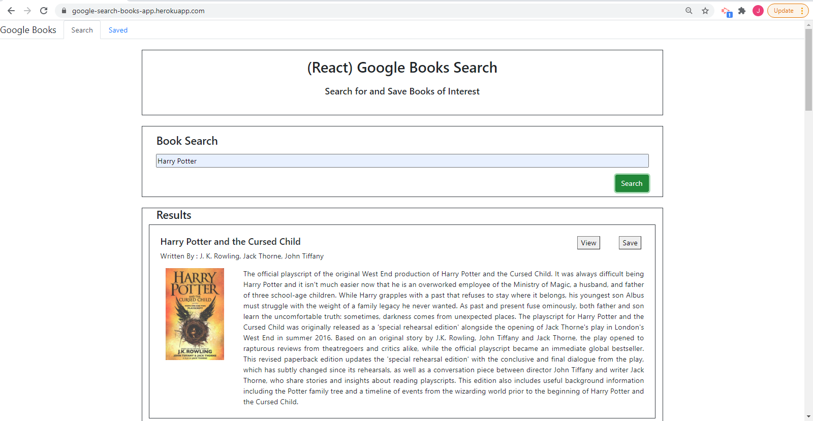

# Google-Books-Search
Google Books Search created using MERN (MongoDB, Express, React, Node)

## User Story
* As a user, I want to be able to search for a book, be able to go to the google link of that book to view it, as well as save a book and delete it.

## Description
This application allows a user to query and view all the related books based on a search using the book title. 
It is a SPA (Single Page Application) that uses react-router-dom to navigate.
There are 2 pages in the application:

  * Search - User can search for books via the Google Books API and render them here. User has the option to "View" a book, bringing them to the book on Google Books, or "Save" a book, saving it to the Mongo database.

  * Saved - Renders all books saved to the Mongo database. User has an option to "View" the book, bringing them to the book on Google Books, or "Delete" a book, removing it from the Mongo database.

  ## Table of Contents
* [Installation](#installation)
* [Usage](#usage)
* [Contributing](#contributing)
* [Questions](#questions)
* [License](#license)

## Installation
1. Pre-requirement is to install a command-line application and node version 14.15.0 or higher.
2. Open the terminal/command-line and open the directory where the project is downloaded. 
3. Enter the command 'npm install' to install all the required package dependencies.

## Usage
1. In the command line/terminal within the directory that the project is downloaded, invoke the application using the command 'npm start' 
2. The application can be accessed using this URL in the browser (https://google-search-books-app.herokuapp.com/)The Google Search Books application will be rendered, with the Navbar that includes the Search and Saved tabs. By default, user lands into the Search tab. Both tabs have a common Header component.
3. The input textbox on the Search Page can be used to enter a book title and search for the book in google books. The search results are rendered in the results section of the page. Every record has a View button that brings the user to the book on Google books, and a Save button that saves the corresponding book to the database.
4. Clicking on the Saved tab navigates the user to the Saved Page. This page displays all the books that have been saved to the 'googlebooks' database in Mongodb. Every saved book record in the Saved Books section has a View button that again brings the user to the book in Google books, adna  Delete button that allows a user to delete any of the existing saved books from the database.

## Contributing
This application has been individually developed by Jesal Mehta. If you are interested in fixing issues and contributing directly to the code base, you can do so according to the guidelines listed in the [Contributor Covenant](https://www.contributor-covenant.org/) industry standard.

## Questions
For any questions,
Here is my Github profile link: [JesalDM](https://github.com/JesalDM)  
You can also reach out to me directly at [jesaldmehta@gmail.com](mailto:jesaldmehta@gmail.com)

## License
This project is licensed under the terms of the MIT license.

## For Review
* Github Repository URL: https://github.com/JesalDM/google-books-search
* Deployed application Heroku URL: https://google-search-books-app.herokuapp.com/
* Application demo: 
* Screenshot :
    
    
  